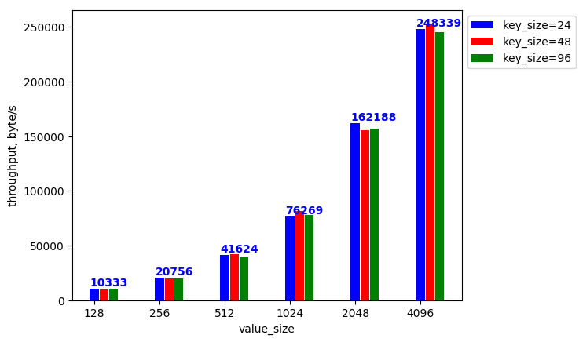
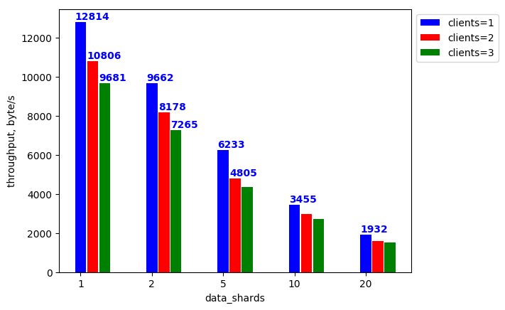

# zstor benchmark

`zstor benchmark` provides tools to analyse performance of `zstor`.

## Getting started

To start the benchmarking provide a [config file](#orchestrator-config-file) for `benchmark orchestrator` (`0-stor/benchmark/orchestrator/`) and run using optional parameters:
``` bash
python3 orchestrator --conf bench_config.yaml --out report
```

Here are the options of the orchestrator:
``` bash
optional arguments:
  -h, --help            help for orchestrator
  -C,  --conf string     path to the config file (default bench_config.yaml)
  --out, string          directory where the benchmark report will be
                        written (default ./report)
```

## Benchmark orchestrator
  
To collect data for an informative benchmark report we need to repeatedly run `zstor` servers and [`benchmark client`](../cmd/zstorbench/README.md) under multiple benchmarking scenarios and collect performance measures. Benchmark scenarios represent combinations of parameters for the `zstor` server and client, being important for performance analysis.

### Orchestrator config file
Config file for the `benchmark orchestrator` consists of two parts:

  * `template` represents the template of the config file for the [`benchmark client`](../cmd/zstorbench/README.md). 

 Number of `zstordb` servers is defined by `distribution_data`+`distribution_parity`, number of `etcd` servers is defined by `meta_shards_nr`.

`iyo` contains token (`organization`, `app_id` and `app_secret`) for authentification via [`itsyou.online`](itsyou.online). If `ioy` is not given, `no-auth` flag is set for `zstor` server and no authentification is performed during the benchmark.

  * `benchmarks` contains information to build multiple benchmark scenarios. In case if `benchmarks` is not provided, the benchmark will run for a single set of parameters, provided in `template`.

 The config for each benchmark is marked by the `prime_parameter` and inside there can be an optional `second_parameter` defined. Inside both `prime_parameter` and `second_parameter` field the `id` specifies what zstor config field is being benchmarked. The `range` field specifies the different values for that zstor config field being used in the benchmarks. This structure allows for setting up the output format for the figures in the output file. 

 If only `prime_parameter` is given, `orchestrator` creates a plot of the system throughput versus values in `range` of the `prime parameter`.
If both `prime_parameter` and `second_parameter` are given, a few plots will be combined in the output figure, one for each value in `range` of `second_parameter`.

Here is an example of the config file:
``` yaml
# benchmark orchestrator config for 1.1.0-beta-2
benchmarks: # list of benchmark scenarios
- prime_parameter:    # primary parameter of the benchmark *
    id: value_size    # id of the primary parameter that is being benchmarked
    range: 128, 256, 512, 1024, 2048, 4096 # values of the primary parameter
  second_parameter:    # secondary parameter of the benchmark *
    id: key_size       # id of the secondary parameter that is being benchmarked
    range: 24, 48, 96  # values of the primary parameter
- prime_parameter:
    id: data_shards   
    range: 1,2,5,10,20
  second_parameter:
    id: clients
    range: 1, 2, 3
template:         # config for benchmark client
  zstor_config:   
    namespace: mynamespace # itsyou.online namespace
    iyo:  # itsyou.online authentification token
      organization: myorg  # itsyou.online organization name
      app_id: appID        # itsyou.online Application ID
      app_secret: secret   # itsyou.online Secret
    pipeline:
      block_size: 2048 
      compression:
        mode: default
      distribution:
        data_shards: 2
        parity_shards: 1
    metastor:
      meta_shards_nr: 2
  bench_config:
    clients: 1      # number of concurrent clients
    method: write   # other options: read
    result_output: per_second
    operations: 0   # max number of operations(reads/writes) in benchmark **
    duration: 30    # max duration of the benchmark **
    key_size: 48
    value_size: 128
profile: cpu
# * in the output figures 'prime_parameter.range' is used in the x-axis, while 'second_parameter.range' enables multiplot.
# ** if both 'operations' and 'duration' are given, interrupts when any of them has reached the limit
```
`result_output` defines time interval to collect intermetiate data throughout the benchmark and takes values `per_second`, `per_minute` or `per_hour`. These samples are used to create timeplots during the benchmark. The timeplots by default are collected in `timeplots.md` If `result_output` is empty of invalid, timeplots are not included.

Here is example of the output figures:

 
 


