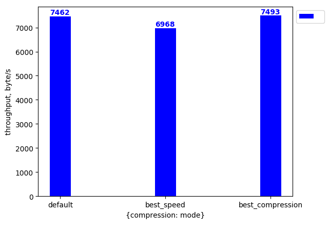

# zstor benchmark

`zstor benchmark` provides tools to analyse the performance of `zstor`.

## Getting started

Compile and install the current version of `zstor` by running the following command in the `0-stor` root:
```bash
make install
```

To start the benchmarking, provide a YAML [config file](#orchestrator-config-file) for the `benchmark orchestrator` (`0-stor/benchmark/orchestrator/orchestrator.py`) and run the `orchestrator` Python script:
``` bash
python3 orchestrator.py --conf bench_config.yaml
```

Orchestrator flags:
``` bash
usage: orchestrator.py [-h] [-C string] [--out string]

optional arguments:
  -h, --help            help for orchestrator
  -C,  --conf string     path to the config file (default bench_config.yaml)
  --out, string          directory where the benchmark report will be
                        written (default ./report)
```

## Benchmark orchestrator
  
The orchestrator sets up a benchmarking environment (zstordb and etcd metadata servers) and uses [`zstorbench`](../cmd/zstorbench/README.md) to collect the performance data. The orchestrator will generate the config files with scenarios and environment configuration for [`zstorbench`](../cmd/zstorbench/README.md) and process the output (of multiple zstorbench runs) to generate a report.

### Supported deployment options:
  * local - deploys `zstor` servers on 1 local device
  * `packet.net` - deploys `zstor` servers on a [`packet.net`](https://packet.net) device. 

### Orchestrator config

Config file for the `benchmark orchestrator` consists of three parts (main fields):

  * `benchmarks`: configuration of what to benchmark
  * `template`: template configuration for [`zstorbench`](../cmd/zstorbench/README.md) client
  * `profile`: defines the type of profiling that's done during benchmarking

Additional optional fields are:
  * `packet.net`: configuration for `packet.net` deployment. More information of [`packet.net`](https://packet.net). If field is not given, `zstor` servers are deployed locally. Additional instructions for [`packet.net`](https://packet.net) deployment are given [bellow](#packet.det-deployment)
  * `branch`: defines a branch for benchmarking and used for [`packet.net`](https://packet.net) deployment.

The `benchmarks` field contains information to build the benchmarking scenarios. In case if `benchmarks` is not provided, the benchmark will run for a single set of parameters, provided in the `template`.

The config for each benchmark is marked by the `prime_parameter` field and an optional `second_parameter` field can be defined. Inside both `prime_parameter` and `second_parameter` field the `id` specifies what zstor config field is being benchmarked. The `range` field specifies the different values for that zstor config field being used in the benchmarks.

If only `prime_parameter` is given, the `orchestrator` creates a plot of the throughput versus values in `range` of the `prime parameter`.
If both `prime_parameter` and `second_parameter` are given, a few plots will be combined in the output figure, one for each value in `range` of `second_parameter`.

The `template` field represents the template of the config file for [`zstorbench`](../cmd/zstorbench/README.md).

Number of `zstordb` servers to be run is deducted from `distribution_data` + `distribution_parity`. The number of `etcd` metadata servers to be run is defined by `meta_shards_nr`.

The `iyo` field contains the credentials for [`itsyou.online`](https://itsyou.online), used for authentication during the benchmark. If the sub fields are empty or the `iyo` field itself is omitted, the benchmarks will run without authentication.  
If authentification is enabled, the `namespace` fields needs to be a valid [`itsyou.online`](https://itsyou.online) namespace, if authentification is disabled, any name can be used or it can be omitted for a random one to be generated.

The `profile` field sets the type of profiling done during benchmarking, if empty, invalid or omitted, no profiling will be done. Valid options are: `cpu`, `mem`, `block`, `trace`.

Example of a config file:
``` yaml
# benchmark orchestrator config for 1.1.0-beta-2
benchmarks: # list of benchmark scenarios
- prime_parameter:    # primary parameter of the benchmark *
    id: value_size    # id of the primary parameter that is being benchmarked
    range: 128, 256, 512, 1024, 2048, 4096 # values of the primary parameter
  second_parameter:    # secondary parameter of the benchmark *
    id: key_size       # id of the secondary parameter that is being benchmarked
    range: 24, 48, 96  # values of the primary parameter
- prime_parameter:
    id: data_shards   
    range: 1,2,5,10,20
  second_parameter:
    id: clients
    range: 1, 2, 3
- prime_parameter:    # primary parameter of the benchmark *
    id:
      compression: mode       # id of the secondary parameter that is being benchmarked
    range: default, best_speed, best_compression    
branch: 1.1.0-beta-2 # branch to benchmark
packet.net:         # config of packet.net deployment, if not given start local deployment
  facility: ams1    # optional, default: ams1. Packet.net facility to deploy on
  plan: baremetal_0 # optional, default: baremetal_0. Packet.net plan (device type)
  os: ubuntu_16_04  # optional, default: ubuntu_16_04. OS of the packet device
  profile: cpu      # optional, default: None. Type of profiling on zstordb (None is disabled)
  profile_dest: ./profile,  # optional, default ./profile. Destination folder where the profiling will be downloaded.
  etcd_version: # optional, default 3.2.13
template:         # config for benchmark client
  zstor_config:   
    namespace: mynamespace # itsyou.online namespace
    iyo:  # itsyou.online authentification token
      organization: myorg  # itsyou.online organization name
      app_id: appID        # itsyou.online Application ID
      app_secret: secret   # itsyou.online Secret
    pipeline:
      block_size: 2048 
      compression:  # snappy is the default, other options: lz4, gzip
        type: gzip # snappy is the default, other options: lz4, gzip
        mode: default # default is the default, for gzip other options: best_speed, best_compression
      distribution:
        data_shards: 2
        parity_shards: 1
    metastor:
      meta_shards_nr: 2
  bench_config:
    clients: 1      # number of concurrent benchmarking clients
    method: write   # other options: read
    result_output: per_second
    operations: 0   # max number of operations(reads/writes) in benchmark **
    duration: 30    # max duration of the benchmark **
    key_size: 48
    value_size: 128
    zstordb_jobs: 512 # defines GOMAXPROCS for zstordb. optional; default 0
profile: cpu

# * in the output figures 'prime_parameter.range' is used in the x-axis, while 'second_parameter.range' enables multiplot.
# ** if both 'operations' and 'duration' are given, the benchmarking stops on the first condition met.
```

## Orchestrator report

The orchestrator will put the generated report into the default folder (`./report`) or the one provided by the `--out` flag.

After the `orchestrator` has run, this folder wil contain a `report.md` Markdown file that contains:
* The config of the benchmark
* Generated figures of the run benchmarks 
* Textual representation of the graph

Example of a report Markdown file can be found [here](assets/example_report/report.md)

The field `result_output` defines a time interval to collect intermediate data throughout the benchmark and takes values `per_second`, `per_minute` or `per_hour`. These samples are used to create time plots during the benchmark. The time plots by default are collected in `timeplots.md` If `result_output` is empty or invalid time plots are not included.

Example of a time plot report Markdown file can be found [here](assets/example_report/timeplots.md)

The profiling results can be found in the `profile_information` sub-folder.

Examples of generated figures for report.md:  
 
 
 

Example of a time plot:

 


## Packet.net deployment

Functions for deployment are included in the package [`zstor_packet_setup`](orchestrator/lib/zstor_packet_setup.py).
In order to start [`JumpScale`](https://github.com/Jumpscale) package has to be installed with this [installation guide](https://github.com/Jumpscale/bash).

To get a client for `packet.net` using [`JumpScale`](https://github.com/Jumpscale) primitives, we need to add an authentification token and a project name to the [`Config manager`]. There are two ways to open the form and add this information:

  1. Run 
  ``` bash
  js9_config configure -l j.clients.openvcloud -i test -s /root/.ssh/id_rsa
  ```
  2. Start `js9` and then call function to get the client \
  ``` bash 
  j.clients.packetnet.get()
  ```

Now the deployment using [`zstor_local_setup`](orchestrator/lib/zstor_packet_setup.py) can be performed.