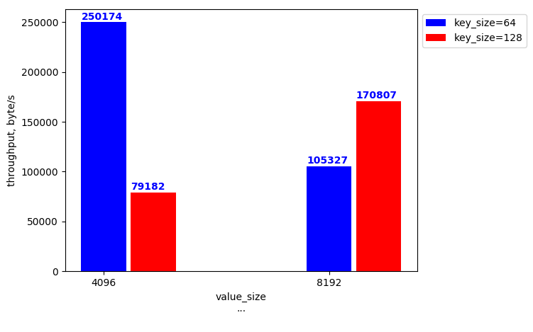

# Benchmark report
[Timeplot collection is here](timeplots.md)

 # Report 1 
**Benchmark config:** 
```yaml 
scenario:
  bench_config:
    clients: 1
    duration: 30
    key_size: 128
    method: write
    operations: 0
    result_output: per_second
    value_size: 8192
  zstor_config:
    pipeline:
      block_size: 4096
      compression:
        mode: default
        type: gzip
      distribution:
        data_shards: 3
        parity_shards: 1
      encryption:
        private_key: ab345678901234567890123456789012
        type: aes

```

 <h3> Throughput, byte/s: </h3>
            <head> 
                <style>
                    table, th, td {
                        border: 1px solid black;
                        border-collapse: collapse;
                    }
                    th, td {
                        text-align: left;    
                    }
                </style>
            </head>
            <table>  
                <tr> <th> value_size
...
</th><th> key_size
...
 = 64 </th><th> key_size
...
 = 128 </th> </tr> <tr> <th> 4096 </th><th> 250174 </th><th> 79182 </th></tr><tr> <th> 8192 </th><th> 105327 </th><th> 170807 </th></tr>
 </table></details>
