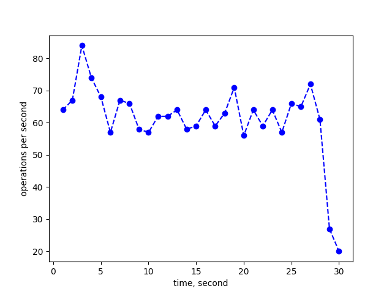
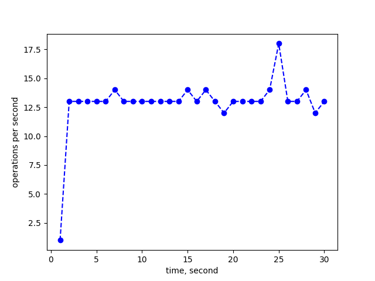
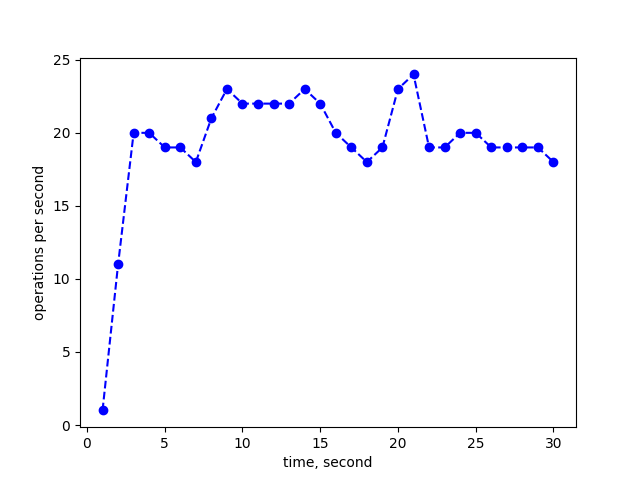
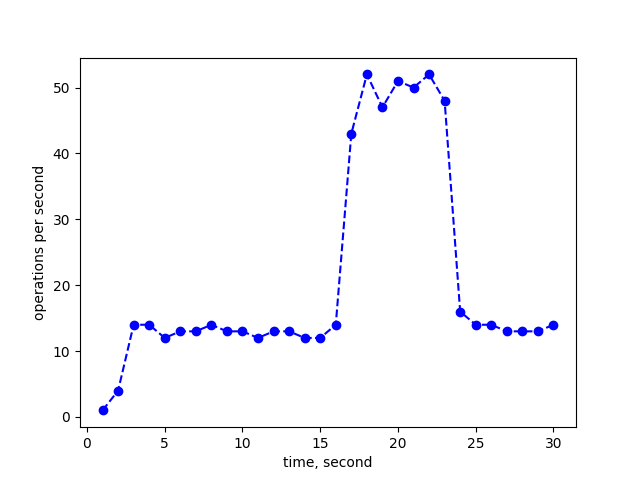

# Timeplot collection report
[Main report in here](report.md) 


 ## Timeplot 1 

**Config:**
```yaml 
results:
- count: 1835
  duration: 30.04369
  perinterval:
  - 64
  - 67
  - 84
  - 74
  - 68
  - 57
  - 67
  - 66
  - 58
  - 57
  - 62
  - 62
  - 64
  - 58
  - 59
  - 64
  - 59
  - 63
  - 71
  - 56
  - 64
  - 59
  - 64
  - 57
  - 66
  - 65
  - 72
  - 61
  - 27
  - 20
scenario:
  bench_config:
    clients: 1
    duration: 30
    key_size: 64
    method: write
    operations: 0
    result_output: per_second
    value_size: 4096
  zstor_config:
    pipeline:
      block_size: 4096
      compression:
        mode: default
        type: gzip
      distribution:
        data_shards: 3
        parity_shards: 1
      encryption:
        private_key: ab345678901234567890123456789012
        type: aes

```
 _____________ 

 

 ## Timeplot 2 

**Config:**
```yaml 
results:
- count: 386
  duration: 30.021786
  perinterval:
  - 1
  - 13
  - 13
  - 13
  - 13
  - 13
  - 14
  - 13
  - 13
  - 13
  - 13
  - 13
  - 13
  - 13
  - 14
  - 13
  - 14
  - 13
  - 12
  - 13
  - 13
  - 13
  - 13
  - 14
  - 18
  - 13
  - 13
  - 14
  - 12
  - 13
scenario:
  bench_config:
    clients: 1
    duration: 30
    key_size: 64
    method: write
    operations: 0
    result_output: per_second
    value_size: 8192
  zstor_config:
    pipeline:
      block_size: 4096
      compression:
        mode: default
        type: gzip
      distribution:
        data_shards: 3
        parity_shards: 1
      encryption:
        private_key: ab345678901234567890123456789012
        type: aes

```
 _____________ 

 

 ## Timeplot 3 

**Config:**
```yaml 
results:
- count: 580
  duration: 30.002623
  perinterval:
  - 1
  - 11
  - 20
  - 20
  - 19
  - 19
  - 18
  - 21
  - 23
  - 22
  - 22
  - 22
  - 22
  - 23
  - 22
  - 20
  - 19
  - 18
  - 19
  - 23
  - 24
  - 19
  - 19
  - 20
  - 20
  - 19
  - 19
  - 19
  - 19
  - 18
scenario:
  bench_config:
    clients: 1
    duration: 30
    key_size: 128
    method: write
    operations: 0
    result_output: per_second
    value_size: 4096
  zstor_config:
    pipeline:
      block_size: 4096
      compression:
        mode: default
        type: gzip
      distribution:
        data_shards: 3
        parity_shards: 1
      encryption:
        private_key: ab345678901234567890123456789012
        type: aes

```
 _____________ 

 

 ## Timeplot 4 

**Config:**
```yaml 
results:
- count: 627
  duration: 30.071129
  perinterval:
  - 1
  - 4
  - 14
  - 14
  - 12
  - 13
  - 13
  - 14
  - 13
  - 13
  - 12
  - 13
  - 13
  - 12
  - 12
  - 14
  - 43
  - 52
  - 47
  - 51
  - 50
  - 52
  - 48
  - 16
  - 14
  - 14
  - 13
  - 13
  - 13
  - 14
scenario:
  bench_config:
    clients: 1
    duration: 30
    key_size: 128
    method: write
    operations: 0
    result_output: per_second
    value_size: 8192
  zstor_config:
    pipeline:
      block_size: 4096
      compression:
        mode: default
        type: gzip
      distribution:
        data_shards: 3
        parity_shards: 1
      encryption:
        private_key: ab345678901234567890123456789012
        type: aes

```
 _____________ 

 
